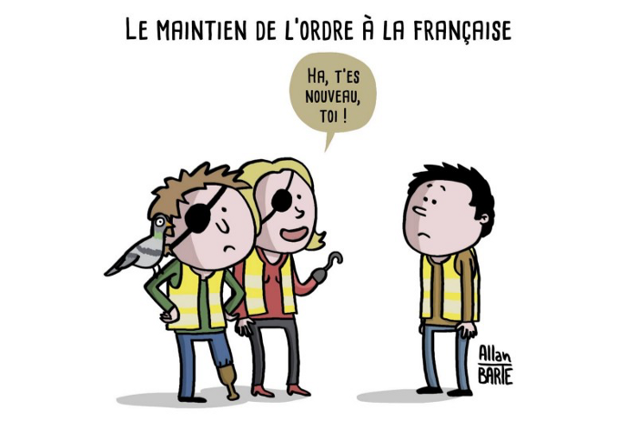

J'ai entendu hier un ami dire, à propos du mouvement des gilets jaunes :

> Combien ils ont fait aux européennes ? 0,5% ? Bon bah voilà, qu'on arrête de nous emmerder avec les gilets jaunes, ils ne représentent rien.

Ça m'attriste toujours d'entendre ce genre de discours, ce genre de dénigrement qui, à mon avis, pourrait s'appliquer à tout mouvement de protestation/contestation quel que soit le pouvoir en place, en l'occurence macroniste. Ce discours est tenu par ses électeurs, cela va de soi. À la place, j'aurais préféré que ces électeurs puissent prendre un peu de recul pour avoir un esprit critique sur l'action de ceux qu'ils ont porté au pouvoir. Cette dernière remarque peut d'ailleurs s'appliquer à tout militant, tout électeur de tout parti : ce n'est pas parce qu'on vote ou qu'on milite pour un candidat ou un parti qu'on doit le faire à tout prix, quels que soient les mensonges et les trahisons que cela peut engendrer. Un peu d'honneur, tout de même !

Revenons donc sur ce mouvement des gilets jaunes, et expliquer
- pourquoi c'est normal qu'il ne représente rien aux élections européennes
- pourquoi il aura été tout de même d'une ampleur extraordinaire, à ne pas sous-estimer

## Échec aux élections européennes: pourquoi ?

Le mouvement des gilets jaunes n'est pas un mouvement politicien. Je n'emploie pas le mot politicien avec une connotation péjorative, mais dans le sens de "prendre une place dans l'offre politique", avec un parti et des leaders. Il ne s'est jamais défini en tant que tel, il a toujours été bordélique, sans réel leader. Il l'a même revendiqué, ce que beaucoup lui ont reproché. Mais c'est comme ça: ce n'est pas un mouvement politicien, mais politique seulement, dans le sens où il portait des revendications relevant du domaine politique, de l'organisation de la collectivité.

Seuls quelques personnages ont souhaité en faire un mouvement politicien et en profiter pour se présenter aux élections européennes, mais à mon sens c'était une erreur de leur part : ce mouvement n'avait pas vocation à se présenter en politique.

Parce que, comme l'expliquait très bien Florence Aubenas , les gilets jaunes sont tout à fait représentatifs de l'ensemble de l'électorat, de l'extrême gauche à l'extrême droite en passant par le centre. Ce qui a rassemblé ces gens, ce n'est pas leur bulletin de vote, mais leur porte-monnaie, plutôt vide. Leurs revendications diverses et variées ne sont pas non plus partisanes, je pense en particulier au Référendum d'Initiative Citoyenne (RIC) qui me tient à coeur.

Cela veut donc dire qu'on retrouve peu ou prou dans ces personnes les mêmes proportions qu'aux dernières élections significatives, à savoir les présidentielles. Aucune raison donc de rassembler derrière la même liste des électeurs du Rassemblement National, de Debout la France, des Républicains, du Parti Socialiste ou de la France Insoumise, et j'en passe. J'exclus volontairement la République en Marche, mais c'est par préjugé seulement, je me trompe peut-être.

Quoiqu'il en soit, ceci expliquant cela, d'où un échec logique aux dernières élections, qui n'attriste que peu de monde.

## Un mouvement extraordinaire: pourquoi ?

Qu'on se le dise: je ne suis pas un gauchiste de base, ni un militant syndical acharné, la preuve étant que je n'ai jamais manifesté dans ma vie, sauf à deux occasions: une fois en 2017 contre la corruption, et une autre fois en 2005 lors des manifestations contre le CPE. En 2017, j'y suis allé par conviction, en 2005 par curiosité uniquement. J'étais et je suis toujours incapable de vous dire en quoi consistait vraiment le CPE, je me fichais pas mal de la politique à l'époque.

En revanche j'ai assisté à 3 manifestations, qui étaient décrites comme plutôt violentes à l'époque, et voici ce que j'ai constaté.

Il existait déjà des personnes et groupes violentes, qui voulaient en découdre avec les forces de l'ordre. On pouvait les voir avancer sur les côtés des cortèges, cagoulés, écharpés, pour aller au front et envoyer ce qu'ils pouvaient (pavés et autres) sur la police. J'étais aussi au front, pas pour caillasser mais pour pour faire acte de voyeurisme uniquement. Je n'avais pas peur, parce qu'il n'y avait pas de raison d'avoir peur. Aucun risque que je ne reçoive un projectile de la part de la police. Au milieu des violents, je me suis bien fait gazer, naturellement, mais c'était probablement mérité. Je pouvais aussi me balader du côté des CRS, sans problème, sans violence. Ils n'étaient pas violents, ils étaient là pour contenir les excès et disperser les violents, ce qu'ils faisaient bien. Je n'ai jamais eu peur, sauf lors de la dispersion à Sèvre-Babylone, le jour ou un kiosque avait pris feu. Pendant une dispersion, tout le monde court partout, policiers et manifestants, et c'est un peu stressant. Mais bon, une fois que c'est fini, plus de stress.

Tout ça pour dire qu'à ces manifestations, il y avait déjà des personnes violentes, à chaque fois, mais il n'y avait pas de violence de la part des CRS, pas d'arme.

Alors que pour le mouvement des gilets jaunes, c'est différent.

J'ai voulu y aller aussi, par soutien et par curiosité. J'avais prévu d'y aller le 8 décembre puisque je passais à Paris ce week-end là. Mais j'avais déjà entendu parler des yeux crevés par des balles en plastiques, j'avais entendu toute la semaine que ça allait être une grosse répression ce week-end, donc je n'y suis pas allé.

L'occasion s'est représentée deux autres fois, mais jamais je n'y suis allé. Par peur de me retrouver malencontreusement avec un oeil en moins.

Et pourtant, sans me jeter particulièrement de fleurs, je ne suis pas quelqu'un qui a peur facilement. J'ai déjà sauté à l'élastique, c'est dire…

Cela montre que ceux qui y sont allés tous les week-ends, bravant le froid, la pluie, l'hiver, l'ennui si l'en était, mais aussi la possibilité, si ce n'est la crainte, de se voir tapé, tabassé, emmené en garde-à-vue, perdre un oeil ; cela montre, disais-je, que ceux qui y sont allés tous les week-ends avaient les crocs.

Parce que la violence était omniprésente dans ce mouvement: d'un côté la violence réelle, qu'elle soit de la part des forces de l'ordre, pilotées in fine par le Ministère de l'Intérieur, ou de la part de certains manifestants, notamment les Blacks Blocs ; de l'autre côté le récit de la violence dans les communications issues du gouvernement, et il est essentiel de revenir dessus parce qu'elle explique tout.

Ce gouvernement, et en particulier son ministre de l'Intérieur Christophe Castaner, ont répété pendant des semaines et des semaines que ce mouvement n'était que violence. Or, autant il faut reconnaître la violence des Blacks Blocs, et on peut la condamner si on veut — une fois qu'on a essayé de savoir pourquoi, tout de même — , autant il faut reconnaître qu'il n'y a pas que des Blacks Blocs parmi les manifestants.

À chaque semaine, j'étais partagé entre ceux qui disent que c'est la police qui cherchait la violence, en créant des nasses d'où personne ne pouvait s'échapper, en infiltrant les manifestants pour commencer des provocations, en laissant des personnes manifestement violentes accéder aux manifestations, etc. J'étais partagé entre ces propos et ceux du gouvernement qui jouait l'innocence, toujours.

Jusqu'au coup de la Salpêtrière qu'on connait tous. Ce jour là, où Castaner a menti ouvertement et outrageusement, tout s'est éclairé dans ma tête.

Oui, les violences des Blacks Blocs existent, j'en suis sûr. Oui, celles des policiers existent aussi, j'en suis sûr aussi, malgré les réfutations aberrantes de Castaner. Mais la pire des violences vient des propos continus de Castaner depuis des mois, au moment où on se rend compte que ses propos n'étaient pas toujours mesurés, loin de là, la preuve avec la Salpêtrière. Pourquoi a-t-il menti ce jour-là ? S'il a menti ce jour-là aussi rapidement, quand a-t-il menti d'autres fois ? Il a démenti parce qu'on a eu des preuves, que se serait-il passé s'il n'y en avait pas eu ?

On se rend compte à ce moment-là que tout est possible : Castaner a menti une fois, l'a-t-il fait avant ? Si ce n'est mentir, a-t-il exagéré avant ? S'il l'a fait avant, ce qui est probable, l'a-t-il fait tout du long du mouvement des gilets jaunes ? Au moins à plusieurs répétitions, probablement. Comment alors faire la part des choses ? Comment savoir le vrai du faux ?

On ne pourra jamais répondre à toutes ces questions, l'honnêteté et l'honneur n'étant pas de mise en politique contemporaine. C'est pourtant ce dont aurait besoin Castaner pour raconter la vérité, la vraie, pas la sienne.

En revanche, on sait l'impact qu'ont pu avoir ses paroles sur le mouvement. C'est d'ailleurs à cause de lui que je ne suis pas allé manifester le 8 décembre, il m'a fait peur. Et s'il m'a fait peur, il a pu faire peur à un certain nombre de gens potentiellement manifestants, qui auraient pu accroître de manière significative les chiffres officiels.

La dernière question que je pose dans cet article est la suivante: sur la base de ce mensonge de Castaner, mettons que sa stratégie tout du long était, si ce n'est de mentir, au moins d'exagérer excessivement la violence du mouvement pour le discréditer. Pourquoi cet excès ? Pourquoi cet excès de violence et verbale et réelle ? Qu'on ne me dise pas qu'il n'avait pas le choix : en 2005, la situation des manifestations était sensiblement identique, sans avoir recours à des fusils pouvant crever des yeux.

Je pense donc que cet excès tire sa source des sondages des premiers jours, ceux qui disaient qu'une large, voire très large majorité soutenait les revendications de ce mouvement : trop de taxes et inconvénients pour les moins riches, pas assez de taxes en comparaison et trop d'avantages pour les plus riches, pas assez de démocratie, etc. Ces revendications allaient contre les souhaits du gouvernement, dont l'assise populaire est faible : 18% d'électeurs au premier tour (si on prend en compte l'abstention, qui peut être par conviction), puis 43% au second, contre Le Pen faut-il le rappeler. Ce qui laissait deux options à ce gouvernement, au soir du 17 novembre : écouter sincèrement les revendications et agir en leur sens, comme a pu le faire Villepin en 2005, contre son propre souhait ; ou persister dans son action impopulaire. C'est la deuxième option qui fut choisie, qui impliquait logiquement le discrédit du mouvement.

J'aurais vraiment souhaité que ce discrédit ne soit pas aussi violent. J'aurais aussi souhaité qu'il ne soit pas mensonger. Incroyable d'ailleurs que ce ministre n'ait pas démissionné, ou que ce gouvernement ne l'ait pas débouté : n'ont-t-ils pas en tête que mentir à des gens, c'est tromper et détruire la confiance qu'ils vous portent, et que la confiance est ce dont tout gouvernement a besoin pour agir en paix ?

Quoiqu'il en soit, c'est pour toutes ces raisons que je salue ce mouvement des gilets jaunes, qui a duré près de 30 semaines, malgré tous les obstacles, et Dieu sait s'ils étaient nombreux et puissants.

Et c'est pour toutes ces raisons que je ne comprends pas ceux qui le condamnent à tout va : il ne le mérite pas. Qu'on me démontre le contraire !

[Crédit photo © Allan Barte](https://en.tipeee.com/allan-barte)
