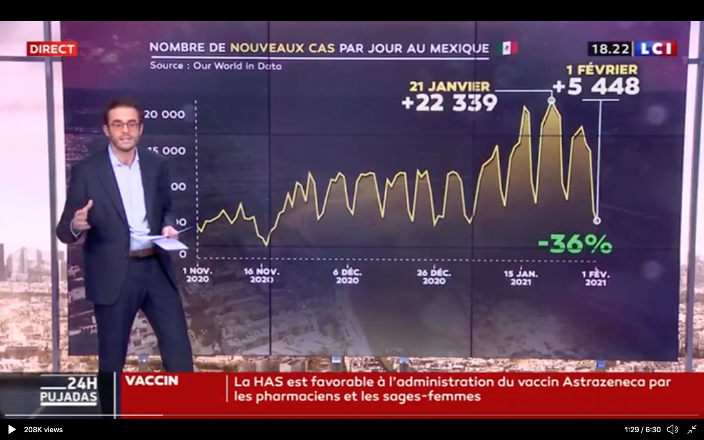
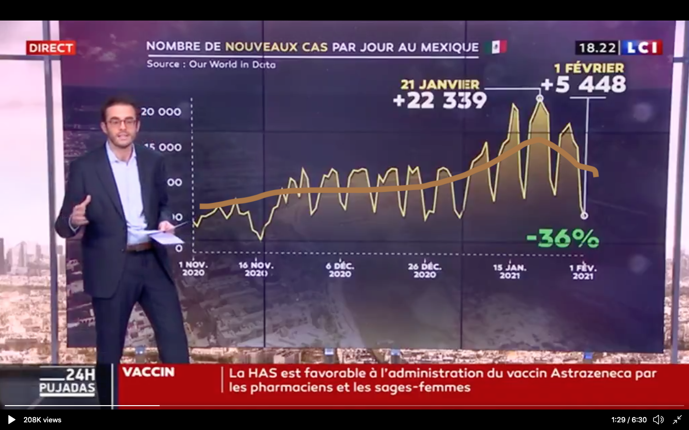
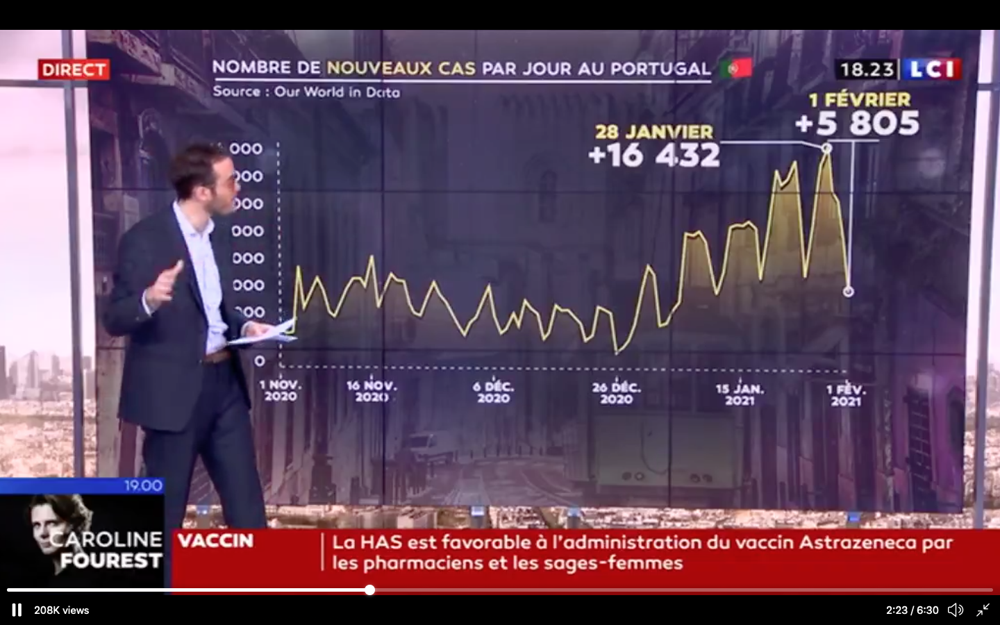
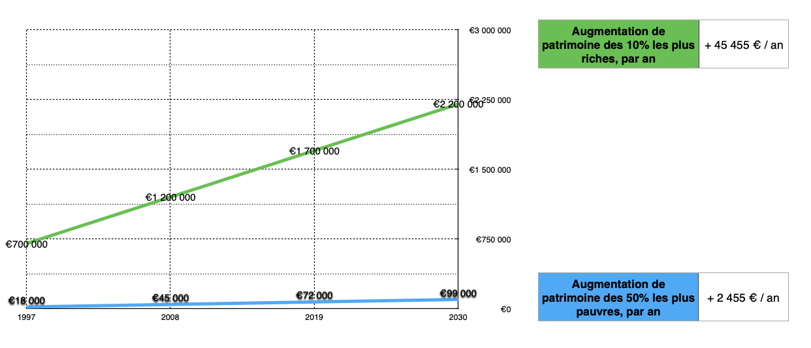
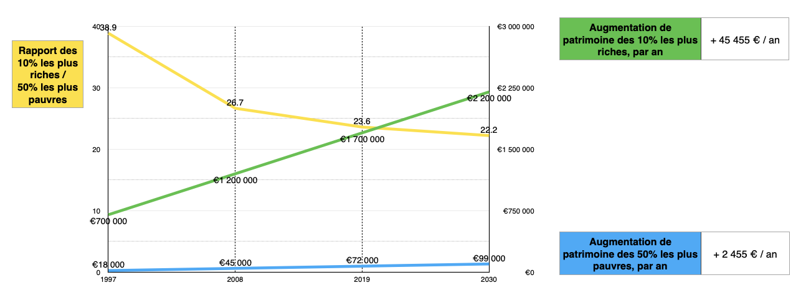

Il est 5h du matin. Hier soir une discussion avec ma mère m'a donné, comme souvent si cette discussion s'ensuit d'une insomnie, l'inspiration pour un petit article. On discutait de ce rôle des journalistes, sensés nous éclairer dans la complexité du monde. Je disais que ces derniers avaient une grosse part de responsabilité dans tout ce qui fait les maux de notre monde moderne : twitterisation de la place publique, recherche constante du buzz, piètre qualité de l'information, etc.

C'est juste après que je tombe sur [cette vidéo de 24H Pujadas](https://twitter.com/24hPujadas/status/1356656327402135552) dans laquelle un journaliste, Baptiste Morin, explique que le nombre de cas du coronavirus baisse, courbes à l'appui.

Oui, son pourcentage de 36% semble correct, mais il ne reflète en aucun cas ni les chiffres mis en valeurs, ni la courbe représentée. Pour nous éclairer convenablement sur la manière dont il a sorti ce chiffre de 36%, il aurait fallu évidemment lisser la courbe. Quand on exploite une courbe comme celle-là, sans lisser les données, en comparant le haut d'un pic et le bas d'un pic, c'est de l'abus ! C'est probablement évident pour tout matheux ici présent, si ça ne l'est pas pour les autres, voici un exemple de lissage.

Symptomatique.  
Du manque de pertinence de certains, en nombre, de journalistes des grands canaux d'information d'aujourd'hui.  
De leur faillite parfois, souvent, dans leur rôle au combien important de continuer notre éducation civique et politique tout au long de notre vie, d'apporter de la nuance entre le discours gouvernemental et la réalité, etc.

Belle exploitation de courbe aussi que celle du Portugal : le pic semble être passé, dit-il...

Ça me fait penser à une autre anecdote : en 2017 mes parents se sont abonnés à la fondation IFRAP, qui publie tous les mois un petit journal. L'IFRAP est - ou sensée être - un think tank, un laboratoire d'idée, plutôt libéral, voire extrêmement libéral, et têtu.  
Je dis "sensée être" parce que en effet, l'IFRAP _via_ sa directrice est sur toutes les ondes, et réclame systématiquement la baisse de toute dépense publique, la baisse de tout impôt, surtout pour les plus riches, en faisant presque tout le temps des biais de réflexion. C'est donc pour moi, [comme d'ailleurs pour l'Assemblée Nationale](https://www.assemblee-nationale.fr/representants-interets/liste.asp), un représentant d'intérêts plus qu'un laboratoire d'idées.

Bref, justement en 2017 chez mes parents, après m'être indigné en découvrant la présence de leur propagande dans le salon, j'ouvre tout de même ce journal par curiosité - pour comparer les prestations télévisuelles et les écrits - et lis cet article : ["Fiscalité sur les successions et les donations : un problème mal posé"](https://www.ifrap.org/budget-et-fiscalite/fiscalite-sur-les-successions-et-les-donations-un-probleme-mal-pose). Je vous passe les détails de l'article, mais en gros : France Stratégie constate que l'augmentation de patrimoine chez les plus âgés et les plus favorisés contribue à l'accroissement des inégalités, il faut donc rectifier le tir en augmentant les impôts. 
> « Les inégalités de patrimoine se sont nettement accrues entre 1997 et 2008, sous l’effet de l’envolée des prix de l’immobilier (…). Sur une vingtaine d’années, le patrimoine brut moyen des 10 % des ménages les plus riches a progressé de 700.000 à 1,2 million d’euros actuels. Celui des 50 % les moins fortunés est passé de 18.000 à 45.000 euros. »

L'IFRAP répond

> Notre analyse  
> Curieusement, le postulat de départ est contradictoire avec les chiffres cités par l’auteur. En effet, selon ces chiffres le rapport des 10% de personnes les plus fortunées aux 50% les moins fortunées est passé en 20 ans de 38,9 à 26,6. Il s’agit donc bien d’une diminution de plus de 30% des inégalités de patrimoine au cours de cette période et non d’une augmentation. [...] Ce postulat étant rectifié, [etc.]

Là je m'étouffe : premièrement parce que j'ai du mal à imaginer dans ma tête ce que veut dire "le rapport est passé de 38,9 à 26,6", il va falloir que je le mette sur papier, et deuxièmement parce qu'il me parait évident que si le patrimoine des 10 % les plus riches est passé de 700.000 à 1,2 million d’euros, et celui des 50 % les moins fortunés de 18.000 à 45.000 euros, les inégalités augmentent, sans aucun doute !  
Les plus riches ont gagné 500.000 euros, les plus pauvres 27.000 euros, qui y voit que les ingalités diminuent ? L'IFRAP, manifestement.
Je mets donc tout sur papier pour vérifier.

D'abord les chiffres de France Stratégie, en extrapolant le même accroissement de 2008 à 2019 puis 2030

Il me semble clair que les plus riches vont plus vite vers le haut que les plus pauvres, donc les inégalités augmentent.  
J'essaye alors de comprendre ce qui est derrière "le rapport est passé de 38,9 à 26,6". C'est en fait très simple : 
> 18.000 / 700.000 = 38,9  
> 45.000 / 1.200.000 = 26,6

Je rajoute dans ma courbe ces chiffres, pour voir ce qu'ils veulent dire.

D'accord, le rapport descend. Qu'en conlure alors ? Eh bien, non pas que les inégalités diminuent, mais que ce rapport... ne veut rien dire quand on parle d'accroissement d'inégalités !  
On voit bien que les courbes vertes et bleues divergent : elles ne vont pas vers se croiser un peu plus, elles s'éloignent l'une de l'autre de plus en plus, donc les inégalités augmentent.

Je leur envoie mon analyse, sans les graphiques, pour savoir ce qu'ils en disent. Ils me répondent que j'ai tort, je leur renvoie mes graphiques, ils me répondent alors que je suis victime d'une illusion d'optique ! Le dernier mail que j'envoie est moins cordial et n'aura jamais de réponse.

L'illusion d'optique, pour rappel :

Morales de mon histoire :
1. Ne plus jamais faire confiance à l'IFRAP
2. Toujours se méfier des vérités énoncées avec autorité parce que chiffres à l'appui
3. Ne plus jamais faire confiance à l'IFRAP
3. Ne plus jamais faire confiance à l'IFRAP, et désormais aussi à Baptiste Morin ! Ou son chef.

