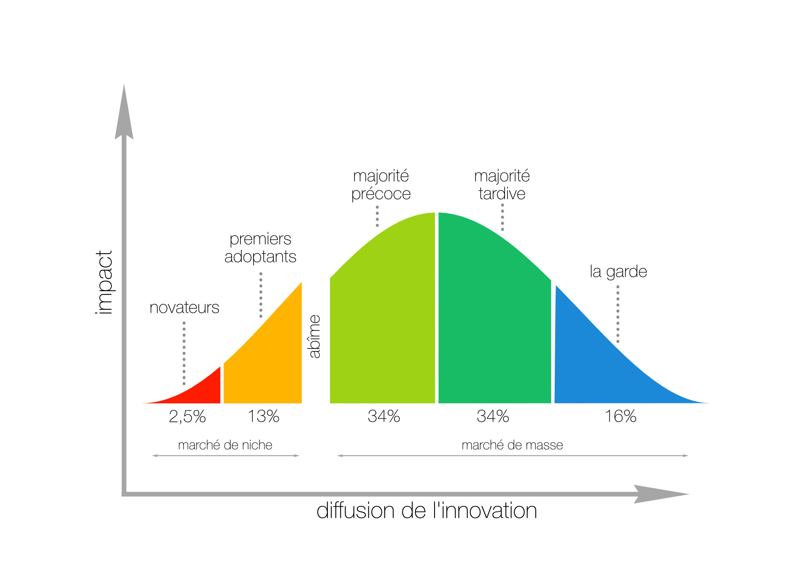

Je ne dirais pas que tout est clair dans mon esprit, mais plus on avance, plus ça s'éclaircit.

À l'aube d'un confinement probable, et pendant qu'on est, ici à Amsterdam, dans une situation de semi-confinement où tous les restos et établissements "non essentiels" sont fermés, toutes les écoles et crèches aussi, et où un couvre-feu est installé à 20h30, j'avance sur les réponses à trouver à mes __Pourquoi__ :
 1. __Pourquoi__, alors qu'on sait désormais à quelle catégorie s'attaque ce coronavirus, à savoir les plus âgés d'entre nous, pourquoi doit-on contraindre la population entière qui, pour la plupart, n'a rien à craindre ?
 3. __Pourquoi__ nous, population, acceptons pour la plupart sans broncher, quoiqu'en rouspétant tout de même, ces mesures qui pourrissent la vie ?
 2. __Pourquoi__ les journalistes continuent de jouer le jeu de la peur, celui des gouvernements, sans y apporter de nuance, si peu ? De sorte que je suis partagé entre l'impression, avec mes analyses statistiques primaires, soit d'être quelqu'un qui n'a rien compris au problème, soit que les journalistes sont incompétents, ou paresseux ?

Mon amour-propre et mes heures d'écoute de France Inter me font pencher, pour la question 3, pour l'option journalistes paresseux, avec beaucoup d'exemples à la clé que je n'énumèrerai pas ici. Je me concentrerai sur les questions 1 et 2.

## Pourquoi les gouvernements contraignent la population entière 

### Les hôpitaux sont submergés

Je sais qu'on me rabâche sans cesse les hôpitaux submergés, et je veux bien comprendre le désarroi et la fatigue du personnel hospitalier.

MAIS

Je veux bien le comprendre quand on est pris par surprise en mars 2020, mais je ne peux pas le comprendre un an plus tard, quand on va m'annoncer que la vie va être encore contrainte jusqu'à l'été. L'État n'est donc pas capable, en un an, de mettre en place des mesures d'urgence, de créer de la place, de former un maximum de gens (réquisitionnés, volontaires) rapidement pour aider le personnel hospitalier compétent ? Tristesse.

Les infos nous le répètent tous les matins, les hôpitaux ont donc l'air dans la même capacité qu'un an auparavant, il faut donc prendre des mesures pour les soulager. C'est décevant, mais... soit, il faut prendre des mesures contraignantes, alors prenons-en. Mais faut-il vraiment en prendre pour tout le monde, même contre ceux qui ne craignent rien ?

### Les plus jeunes ne craignent pas grand chose

Cette année passée nous a montré une chose : ce coronavirus est dangereux pour les personnes avec certaines comorbidités, d'autres personnes à risque et les personnes âgées en général. Mais il est presque anodins pour les personnes de moins de 60 ans, voire moins de 65 ans. Certes, on ne connait pas toutes les séquelles, s'il y en a, qu'on peut garder après avoir contracté la maladie, même chez les plus jeunes, mais en ce qui concerne la maladie en elle-même, pour l'écrasante majorité des moins de 65 ans, ce coronavirus ne tue pas ni ne renvoie en réanimation.

Permettez-moi d'insister pour enfoncer le clou : ce ne sont pas ceux qui sont malades pendant deux semaines, avec un peu de fièvre et sans plus, qui ont de la chance, non. Ce sont ceux qui ont des formes sévères qui n'ont vraiment pas de chance !

Je ne vais pas refaire tout un exposé de statistiques ici, j'en ai déjà fait [un exercice ailleurs](https://www.javolution.io/j-ai-le-coco/), mais tout de même : on était, en France et un peu partout dans les pays ou le COVID fait le plus de cas, à 1 mort sur 2000 habitants l'été dernier, et on est à plus ou moins 2 - 3 morts sur 2000 aujourd'hui, que ce soit en France, en Angleterre, aux États-Unis, en Italie ou en Suède. Sur presque 73 000 morts en France aujourd'hui, 70 000 morts on plus de 60 ans, 65 000 plus de 70 ans, et 55 000 plus de 80 ans. Seulement 1500 ont entre 50 et 60 ans, et... moins de 700 ont moins de 50 ans. Donc : si on a moins de 60 ans, et qu'on meurt du COVID, c'est qu'on a vraiment, vraiment pas de chance, et non l'inverse. (Ou alors je n'ai rien compris, ce qui n'est pas impossible bien sûr. Mais pour la suite de l'article, considérons que ce n'est pas le cas).

Si je faisais mon journaliste, je pourrais dire : « SCOOP !! En France, 10% de morts de plus que d'habitude en 2020, donc faites tous très très attention, c'est grave ce virus, vous avez 10% de chances de plus de mourir qu'en temps normal ! ». Mais ces 10% de morts, c'est 10% parmi les plus de 80 ans, ceux qui ont déjà en moyenne 15% de chances de mourir dans l'année.

Donc si on enferme les gens chez eux, ce n'est pas pour les protéger eux puisqu'ils ne craignent rien ou si peu, mais pour protéger ceux qui ont besoin de l'être, à savoir certains profils à risque et les plus âgés. Mais alors, si vraiment on a besoin de les protéger pour protéger notre personnel hospitalier, pourquoi on ne leur imposerait pas, à eux seulement, de rester chez eux ? Pourquoi, au lieu d'interdire _seulement_ aux gens actifs de ne pas aller voir de personne à risque, on leur impose aussi de rester chez eux ? Quel est le sens de cette mesure ?

### Les jeunes ne sont pas ceux qui votent

C'est étrangement un des journalistes que j'apprécie le moins, c'est peu dire, qui m'en donne la réponse, claire et limpide: [Patrick Cohen, dans un édito de 3 minutes du 22 janvier](https://www.facebook.com/cavousf5/videos/1097526534097200/).

> En France, peu de chance que cette idée [de reconfiner seulement les plus âgés et les plus fragiles] trouve des relais. C'est une idée peut-être scientifiquement pertinente, mais politiquement indéfendable et électoralement suicidaire.

C'est effectivement la seule explication que je trouve plausible. Effectivement, à partir du moment on on constate que les jeunes ne se déplacent plus trop pour voter, mais que les anciens oui, en nombre, alors en tant qu'élu il faut prendre leur parti.

Je ne vois que cela comme explication, parce que dans cette histoire de coronavirus, je ne crois à aucun complot. Je ne pense pas que ce virus a été introduit volontairement. Je pense que personne, surtout les politiques, n'a intérêt à ce que la situation perdure - modulo les labos pharmaceutiques qui se font pas mal d'argent, sur ce sujet ils convaincront peut-être nos décideurs de vacciner tous les ans, mais pas de laisser les gens enfermés. Je ne crois donc pas à un quelconque complot dans cette histoire.

En revanche, je crois que les politiciens font ce qu’ils font depuis toujours, à savoir des calculs pour savoir qui ils doivent flatter pour être élu, et je crois qu'une fois au pouvoir, il font tout pour y rester, le plus longtemps possible. Donc le raisonnement de Patrick Cohen me parait logique et compréhensible, quoique désolant.

En revanche, il rajoute 

> L'un des malheurs de ce virus est qu'il est terriblement inégalitaire [en ciblant principalement les personnes âgées et vulnérables], alors que la France est un pays foncièrement égalitaire où les politiques et les citoyens n'endosseront jamais une mesure ouvertement inégalitaire

Là, je pense qu'il se trompe complètement, sur deux aspects. Le premier serait que ce virus serait inégalitaire parce qu'il s'attaque d'abord aux plus faibles, donc les plus âgés. Oh surprise ! Il ne s'attaque pas aux plus forts, à ceux qui ont une santé de fer ? Incroyable... Ce virus ne fait que son travail comme bien d'autres autres virus. De façon plus virulente certes, mais son caractère inégalitaire n'est pas plus prononcé chez lui que chez les autres virus. D'autre part, il s'avance beaucoup en pensant que les citoyens refuseraient cette mesure qu'ils jugent inégalitaire : sachez que je milite pour, et que je sais que je ne suis pas le seul ! Et surtout, je ne trouve pas cette mesure plus inégalitaire que ça, c'est plutôt le confinement général que je trouve injuste. Demandez aux étudiants ce qu'ils en pensent, à toutes les entrepreneurs fermés, à tous les parents qui galèrent à gérer leurs enfants en même temps que leur travail...

## Pourquoi nous acceptons sans broncher

En fait, j'y ai réfléchis longtemps, peut-être des années, et la réponse est plus simple qu'elle n'y parait. Elle m'est apparue pendant la longue lecture de [cette biographie de De Gaulle](https://www.seuil.com/ouvrage/de-gaulle-julian-jackson/9782021396317), lorsque je me posais alors ces questions : qu'aurais-je fait en 1940 ? Pourquoi tout le monde n'a-t-il pas suivi de Gaulle ?

Il y a ce concept dont on m'avait parlé qui disait qu'un produit, lorsqu'il est nouveau, est d'abord adopté par une minorité de personne avant d'être adopté par le monde entier. C'est progressif, ça suit une courbe en cloche (courbe de Gauss pour les intimes). Il se trouve que ce concept a un auteur : [Evrett Rogers](https://labokhi.ch/fond/loi-devrett-rogers/)

Appliquez ce concept à l'adoption d'une idée par une population, et on a notre solution. Faisons un parallèle avec la Seconde Guerre mondiale si vous le voulez bien.

En 1940, Pétain signe un armistice pour en finir le plus rapidement possible avec la bataille de France, courte, 22 ans après une guerre au combien meurtrière. On ne sait pas à quelle sauce on va être mangés par les nazis, on ne connais pas encore la déportation, la solution finale et l'extermination des juifs, homosexuels et gitans, on connait peut-être mal l'autorité abusive du régime nazi, etc. En plus de ça, Pétain est à ce moment-là hautement respecté pour ses faits d'armes lors de la Première guerre, qui plus est il est chef du gouvernement.
En opposition, de Gaulle est inconnu, général depuis seulement quelques mois, sous-secrétaire d'État à la guerre, et il décide de s'échapper à Londres pour dire que la France à capitulé et que lui seul représente la France. Ni Churchill ni les autres chefs d'État, et pas grand monde d'ailleurs, ne le considère tellement au début. Il apparait surtout comme un fou, un obsédé par l'indépendance de la France.

C'est, grossièrement, l'affiche qui se présente en juin 1940. Rajoutez à ça qu'on ne demande à personne de choisir entre Pétain ou de Gaulle,  qu'aurais-je fait, qu'auriez vous fait en 1940 : auriez-vous tout de suite choisi de suivre De Gaulle ? Il y a très, très peu de chance. Puis le temps passe, et lorsqu'on se rend compte au fur et à mesure que Pétain dépasse les bornes dans sa collaboration avec les plans abjectes de l'occupant, on commence à voir s'il n'y a pas mieux à suivre que lui : c'est là que la popularité de De Gaulle entame sa folle ascension.

Ce comportement du peuple est, je pense, comparable à ce qui se passe - en moins dramatique bien sûr - depuis presque un an.

Lorsqu'on nous annonce un confinement parce qu'un virus nouveau et inconnu arrive, on dit presque tous oui. Lorsqu'un an plus tard, on s'aperçoit que ce virus n'est pas dangereux pour tout le monde de la même façon, mais qu'on applique les mêmes contraintes à tous sans distinction, certaines voix s'élèvent pour s'insurger. C'est normal que ça ait lieu aujourd'hui, c'est tout aussi logique que ça n'ait pas eu lieu des mois auparavant.

La relative lenteur de la réaction s'explique encore plus par le sentiment de peur exprimé par les gouvernants et relayé sans nuance ou presque par la plupart des acteurs médiatiques. Alors même que justement, et nous l'avons déjà expliqué au-dessus, une nuance aurait pu et du se faire, pour permettre au citoyen qui s'informe d'avoir une information solide pour se faire une idée nuancée. Comparer par exemple le nombre de morts du COVID aux USA avec le nombre de morts pendant la guerre mondiale, à quoi bon si ce n'est à faire peur ? La peur induit l'immobilisme, le suivisme, l'absence de reflexion objective. La peur est un outil très bien manié par n'importe quel gouvernement pour maintenir son autorité, le rôle du média doit justement être celui du tampon entre les gouvernants et les gouvernés, qui doit relativiser et nuancer les affirmations émanant des gouvernants, souvent exprimées avec autorité pour leur donner plus de poids qu'elles n'en ont en réalité.

Ainsi, même si [cette vidéo est très drôle](https://www.youtube.com/watch?v=MPUtm6jQmPE), le peuple n'est pas comparable à un troupeau de mouton sans cerveau ! C'est juste qu'on ne peut pas attendre d'une foule immense qu'elle suive rapidement une direction autre que celle qui lui est imposée. Il faut laisser le temps au temps.

## Que faire ? Que penser alors ?

Les gouvernements vont faire ce qu'ils pensent que la majorité des gens voudraient qu'ils fassent. Pour ce faire, ils communiquent beaucoup et, entre autre, utilisent la peur pour amener les gens à penser comme eux. Puisque les médias font faillite dans leur retranscription des évènements, en n'atténuant jamais cette peur voire en l'exacerbant, difficile pour le citoyen de s'insurger si besoin.

Pourtant c'est ce dont on a besoin : une insurrection des consciences, comme le font les étudiants en ce moment, afin de donner un autre son de cloche au reste de la foule, qui à son tour peut réfléchir différemment, en masse, et arriver à d'autres conclusions que celles prônées par les gouvernements. Ces derniers, en sentant le vent qui tourne, se mettront peut-être dans le sens de ce nouveau courant.

Cela étant dit, mon opinion sur la gravité du virus n'engage que moi et est peut-être fausse, auquel cas tout mon exposé s’effondre, j’en conviens. Mais j'ai suffisamment planché sur le sujet pour penser qu'on en fait trop. Cela m'amène à vouloir les choses suivantes : au lieu de tout fermer, tout confiner et verser des milliards d'euro d'aide à ceux qu'on empêche de mener leur vie à bien, vivons normalement, avec masques et gestes barrières là où il faut, en isolant temporairement les personnes à risque, et en formant d'urgence un personnel de soutien (pas des médecins, pas d’infirmière, mais des petites mains utiles) au personnel hospitalier afin que leur capacité de prise en charge soit augmentée significativement, suffisamment pour éviter au maximum de sélectionner les patients à l'entrée des hôpitaux.

J'ai pris mon parti, prenez le vôtre !

