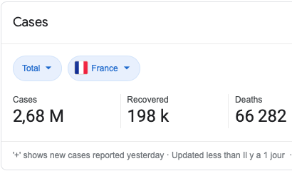

Depuis une dizaine de jours, j'ai le coco. On l'a attrapé en famille, on s'est testé en famille, on est resté plus ou moins confinés, toujours en famille. Depuis hier, l'odorat revient petit à petit, ça sent la fin ! Pour l'instant la maladie a été plutôt simple à vivre, touchons du bois.

À vrai dire, si on regarde les statistiques, il y a(vait) peu de chances que ça s'empire, que j'aille à l'hôpital ou que j'en meure. Il y a des chances, oui, mais peu, très peu, trop peu pour m'inquiéter. De manière générale, lorsque statistiques il y a, je préfère toujours me placer dans la statistique positive, et donc réagir au malheur lorsqu'il est là plutôt que de l'anticiper toujours et qu'il n'arrive jamais. Ce qu'il y a de bien avec les statistiques, c'est qu'on peut les prendre comme ça nous arrange : la statistique ne fait que refléter ce qu'il s'est passé, pas ce qui se passera, donc lorsqu'il s'agit de vouloir prévoir son futur en regardant les statistiques du passé, libre à nous de s'inclure dans la statistique qui nous plait.

Je vous présente donc un petit florilège de statistiques diverses et variées, pour remettre en perspective les stats du coronavirus.

# Résumé de statistiques de la COVID

Pour rappel, quelques stats du coco (sources: [Google](https://www.google.com/search?client=safari&rls=en&q=statistiques+covid&ie=UTF-8&oe=UTF-8), [data.gouv.fr](https://www.data.gouv.fr/fr/datasets/donnees-hospitalieres-relatives-a-lepidemie-de-covid-19/) et [franceinfo](https://www.francetvinfo.fr/sante/maladie/coronavirus/infographies-covid-19-morts-hospitalisations-age-malades-l-evolution-de-l-epidemie-en-france-et-dans-le-monde-en-cartes-et-graphiques.html)):

- 30 000 personnes mortes lors de la première vague, pour l'instant 35 000 lors de la seconde, rapportés aux 67 millions de français, ça fait 0.5 mort pour 1000 personnes. Considérons la vague unique, et ça fait environ 1 mort pour 1000 personnes.
- Les États-Unis, tant critiqués pour leur nombre affolant de morts, enregistrent pour le moment 350 000 morts pour 330 millions d'habitants, soit un peu plus d'1 pour 1000 : pour la France, pas de quoi pavaner plus que ça !
- Si on considère que l'ensemble des décès en EPHAD ont plus de 80 ans, on peut considérer que sur 1000 décès, 737 ont plus de 80 ans, 230 ont entre 60 et 80 ans, 30 ont entre 40 et 60 ans, et 3 ont moins de 40 ans (les chiffres bruts donnent : 10 morts de moins de 20 ans, 189 entre 20 et 40 ans).

# Autres statistiques pour comparer

### Décès des plus de 80 ans en temps normal

D'après les [chiffres de la pyramide des âges de l'INSEE](https://www.insee.fr/fr/statistiques/1913143?sommaire=1912926&q=pyramide+des+ages), si on compare la mortalité par tranche d'âge sur deux années disons normales, 2017-2018 par exemple, on peut savoir quelle probabilité on a de mourir en fonction de son âge. Par exemple, la différence entre ceux qui ont 70 ans en 2017 et 71 ans en 2018 nous apprendra, aux migrations près, combien sont morts dans l'année.

Décès dans l'année - par exemple, il y avait 298 700 personnes de 90 ans en 2017, et 275 000 personnes de 91 ans en 2018, donc environ 23 700 de 90 ans sont mortes dans l'année, ce qui fait environ 80 morts pour 1000 nonagénaires

La stat la plus défavorable, c'est pour les centenaires : 1/4 d'une tranche d'âge meurt dans l'année. 250 centenaires sur 1000 meurent dans l'année.
Pour les 90 ans et plus, entre 80 et 100 sur 1000 meurent dans l'année. Pour les 80 ans, c'est 25 dans l’année. Pour les 70 ans, c'est à peu près 10. En dessous, c'est moins de 10 sur 1000.

Pas de conclusion à en tirer particulièrement, c'est juste pour mettre en perspective les chiffres.

### Décès des plus de 80 ans en temps de COVID confiné

Si on ajoute à ces "temps normaux" les décès des plus de 80 ans, proportionnellement au nombre de décès habituels, on a aussi des chiffres intéressants.
Exemple pour les 80 ans : il y avait 430 700 personnes de 80 ans en 2017, 420 400 de 81 ans en 2018, donc 10 300 personnes sont décédées dans l'année, ce qui représente 24 octogénaires décédés dans l'année pour 1000. Si on rajoute le nombre de décès dû au COVID en proportion, ça fait environ 730 de plus, soit 25.5 octogénaires décédés dans l'année pour 1000.
Exemple pour les 95 ans : il y avait 150 200 personnes de 95 ans en 2017, 128 200 de 96 ans en 2018, donc 22 000 personnes sont décédées dans l'année, ce qui représente 146 décès dans l'année pour 1000. Si on rajoute le nombre de décès dû au COVID, ça fait environ 1570 de plus, soit au total 157 personnes pour 1000 de cet âge décédées dans l'année.

Beaucoup plus ? Pas beaucoup plus ? À vous de voir. "Oui mais y'a eu le confinement qui en a protégé un paquet !" Soit, multipliez alors ces chiffres par 2, 3 ou 5, et tirez-en vos conclusions !

### Varicelle

Source [Wikipédia](https://fr.wikipedia.org/wiki/Varicelle#Épidémiologie), copié-collé:

> Chaque année, en France, on compte environ près de 700 000 cas de varicelle (90 % ont moins de 10 ans), 3 000 hospitalisations (75 % ont moins de 10 ans) et 20 décès (30 % ont moins de 10 ans). Ces données montrent que la varicelle est habituellement bénigne, presque obligatoire chez l'enfant ; mais aussi que la gravité de la varicelle peut augmenter avec l’âge, le risque de décès (complications pulmonaires et neurologiques) étant le plus élevé aux âges extrêmes de la vie.

Ça parait beaucoup quand on y pense ! 20 morts de la varicelle en France par an, je savais pas... et 3000 hospitalisations, c'est pas rien non plus ! D'autant que c'est plutôt contagieux comme maladie. Et pourtant, on ne panique pas beaucoup face à cette maladie.
Parce qu'effectivement y'a pas beaucoup de raison de paniquer : il y a environ 800 000 naissances par année en France, avec un taux de mortalité infantile presque nul, donc il y a environ 8 millions d'enfants de moins de 10 ans. Le calcul avec les données ci-dessus donne que, sur 1000 enfants de moins de 10 ans, 79 attrapent la varicelle, 0.4 vont à l'hôpital, et... presqu'aucun ne meurt. Bon, étant donné qu'il existe un vaccin contre la varicelle, peut-être que ça ne ferait pas de mal non plus de le faire pour éviter ça !

### Grippe

Préambule pour calmer les foules qui s'excitent déjà : la COVID est plus grave que la grippe, à n'en pas douter, de part les symptômes, la contagiosité, et la mortalité aussi, etc. Là n'est pas le propos, j'essaye juste de montrer des chiffres pour pouvoir mettre en perspective nos stats du COVID. Je prends ceux de la grippe parce qu'ils sont facile d'accès et que, n'étant pas médecin, je ne connais pas non plus un million de maladies. Mais le COVID n'est pas une grippette, bien entendu.

Citons donc [l'Institut Pasteur](https://www.pasteur.fr/fr/centre-medical/fiches-maladies/grippe) :

> La grippe est une infection respiratoire aigüe contagieuse due aux virus influenza, dont la particularité est la grande variabilité génétique. C’est un enjeu de santé publique de par les épidémies saisonnières annuelles qui touchent chaque année 2 à 8 millions de personnes en France, avec un excès de mortalité attribuable à la grippe de 10 000 à 15 000 décès, principalement chez les sujets fragiles. Le risque pandémique associé à la grippe zoonotique constitue également un enjeu majeur de santé publique. Une politique de surveillance active est en place au niveau national et international.

Citons aussi [la CAF en 2017](https://www.caf.fr/allocataires/vies-de-famille/accident-de-vie-precarite/sante/le-vaccin-contre-la-grippe-sauve-des-vies):

> 1,9 million de consultations, 40 000 passages aux urgences, 6 300 hospitalisations, soit le chiffre le plus élevé depuis 2010 : l’hiver dernier, la grippe a encore frappé. Plus de 14 000 décès lui seraient imputables, essentiellement chez des personnes âgées.

10 à 15 mille décès par an, malgré vaccination. Quelles seraient les stats sans la vaccination ? Je n'ai pas trouvé, si quelqu'un peut m'aider...!

Bon ça fait quand même beaucoup moins que pour le COVID, après une année sans vaccination mais avec confinement ! Mais les proportions en matière de mortalité sont relativement comparables : le COVID ne fait pas 1000 fois plus que de victimes que la grippe, ni même 100 fois plus, mais pour l’instant 4 fois plus.

# Toutes ces stats pour quoi ?

J'ai fait ces statistiques avec une arrière-pensée, bien sûr...

Personnellement, ça me fait penser que ces chiffres du COVID qu'on nous crache tous les matins à la radio, et qui se veulent être la preuve du bien-fondé de toutes les mesures restrictives qu'on a à endurer, ne méritent peut-être pas toute la gravité qu'on leur prête. Avec les chiffres on peut faire peur, et ça fonctionne plutôt pas mal, c'est efficace. "60 000 morts, c'est beaucoup", disait le monsieur vaccin du gouvernement à la radio il y a quelques jours. C'est sûr, c'est plus que 0, c'est plus que la grippe, mais dire que c'est beaucoup, comme ça au micro, sans aucune mise en perspective, c'est peut-être pas très malin non plus. La [ministre déléguée chargée de l'Autonomie disait](https://www.liberation.fr/politiques/2021/01/04/la-vaccination-n-est-pas-un-echec-mais-castex-voudrait-mieux-anticiper-les-prochaines-etapes_1810281) de son côté, à propos du protocole sanitaire dans les écoles : "Nous ne mettrons jamais en danger les enfants sciemment.", et le journaliste de réagir : "Encore heureux". Pourquoi parle-t-on même du cas des écoles et du danger pour les enfants ? Il y a plus de morts d'enfants par la varicelle que par le COVID...

En plus de ces stats, on a aussi des exemples de cas graves, pas drôles. On m'a même dit dans une discussion ou je tenais à peu près ces propos, que je ne pouvais pas comprendre parce que je n'étais pas à l’hôpital, que je n’avais pas vu ce que c’était d’avoir un cas grave de COVID. Dans la même veine, c'est le Ministre Véran qui disait la même chose à l'Assemblée Nationale, en disant qu'une personne d'une trentaine d'année était en réanimation. Mais cet argument ne peut pas tenir, parce qu'outre le fait que c'est prendre les gens par les sentiments avec des cas qui ne sont pas représentatifs parce qu’ils sont rares, c'est aussi sous-entendre qu'on pourrait interdire beaucoup de choses sous prétexte que le soin est grave ! Demandez à ceux qui s'occupent des accidentés de la route s'ils conseillent de prendre le volant...

Mon point, c'est de poser la question : est-ce qu'on en a pas trop fait ?

Confiner en mars, parce qu'on ne connaissait pas la maladie, qu'on avait pas de masque ni de surblouse, et que les hôpitaux étaient saturés, à la rigueur, et encore.

Mais depuis on a appris pas mal de choses quand même, notamment que la population touchée est plutôt très âgée. Est-ce que ça vaut le coup de couvre-feuter, de fermer crèches, écoles, centres culturels et magasins divers et variés, qu'on profite pour appeler "non-essentiels" ? "La santé avant l'économie", parait-il, mais on sait très bien quelles conséquences ça a aussi de faire arrêter de vivre des millions de personnes, et de les enfermer chez elles : c'est pas joli joli non plus. 

J'imagine bien que nos décideurs ont eu le même genre de réflexion, voire plus. Ce qui est étrange, c'est qu'on ne peut même pas soupçonner d'un complot dans cette histoire, puisqu'à part les labos pharmaceutiques qui font fortune, cette situation n'arrange personne, ni les gouvernés, ni les gouvernants. Ces derniers ont pris leurs décisions avec le slogan "la santé avant l'économie", en sachant que leur choix était polémique, et qu'il l'aurait été aussi s'ils avaient choisi de ne pas confiner, ne pas fermer tout. Mais est-ce qu'ils pensent vraiment que les enfants sont en danger ? Est-ce qu'ils se disent que 60 000 c'ést énorme ? Mais que c'est rien comparé aux États-Unis ? Dans quel état d'esprit prennent-ils leurs décisions ?

Voilà, mon point dans cet article, ce n'est pas de dire ce que j'aurais fait, moi Président, mais plutôt d'aider à digérer des statistiques sans les vomir, sans en avoir trop peur. Je ne sais pas quel effet cela aura sur vous, mais moi ça m'aide à relativiser tout de même.

J'entends déjà la foule chuchoter: mais Arnaud, et si j'étais Président alors ? T'aurais fait quoi ?

Allez... je voulais pas le faire... mais je craque.

Je ne sais pas ce que j'aurais fait, mais je pense qu'il est toujours temps de se rattraper, de mettre en perspective tous ces chiffres et de redevenir plus raisonnable : que ceux qui ont à se protéger, ceux qui soignent et ceux qui craignent pour leur vie, se protègent, et que ceux qui n'ont rien à craindre continuent de se laver les mains et, à la rigueur, porter un masque ici ou là, mais qu'on arrête les quarantaines à tout va, les isolements difficilement supportables, qu'on laisse le monde vivre, ça me parait plus raisonnable. La vie normale pour tous ET la santé de quelques uns, voilà mon credo !

[MODIF] Mon premier relecteur me fait part de l'absence totale de la saturation des hôpitaux dans cet article, qui est officiellement LA raison pour laquelle on fait tous ces efforts. C'est vrai que ça me surprend moi-même ! Cette absence vient probablement du fait que tous les médecins et infirmières de mon entourage me disent qu'ils ne sont pas sous tension, j'en déduis donc, peut-être à tort, que le système entier n'est pas sous tension non plus. Mais de toutes façons, le point de mon article, c'était plutôt retourner les chiffres qui font peur, pas faire une analyse globale du pourquoi du comment.
Cela me permet toutefois de finir cet article par deux remarques sur cette saturation : d'une part, ne pas trouver une autre solution qu'arrêter un pays de 67 millions de personnes, grande puissance économique mondiale, une deuxième fois (!) parce qu'on ne sait pas s'organiser pour gérer un surplus de quelques 4-5-10 milliers de patients, c'est décevant - et ce n'est pas décevant que de la part de la France, mais aussi de l'Allemagne, des Pays-Bas, etc.
D'autre part, il y a quand même un paradoxe : si cette pandémie était arrivée il y a 50-60 ans, peut-être aurions-nous été si démunis en services de réanimation que, fatalement, nous n'aurions pas su soigner ce COVID, et probablement laissé les gens vivre normalement. Aujourd'hui, nous savons soigner, mais pas tout le monde en même temps, donc on s'arrête de vivre pour gérer le surplus : on devrait faire mieux !
