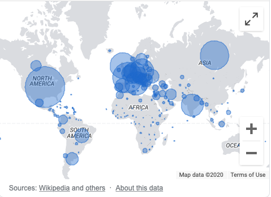

Je ne suis pas anti-vaccin : mon fils de dix-huit mois est vacciné de tous les vaccins possibles, et je ne sais même pas lesquels puisqu'il est vacciné en néerlandais et je n'ai pas prix la peine ni de lire, ni de traduire les vaccins qu'on lui administre. Pas très malin...

Alors pourquoi, me demandez-vous, ne voudrais-je pas me faire vacciner contre cette COVID-19 ?

# Mortalité de ma classe d'âge trop faible

Déjà, il n'y a pas beaucoup de morts de la COVID. Rapportez le chiffre de 40 000 morts, paix à leurs âmes, aux 70 millions d'habitants, ce n'est pas grand chose. 

Ensuite, dans ma classe d'âge, il y a encore moins de mort. À peu près 400 morts pour la tranche d'âge 1-45 ans, c'est insignifiant.

Donc le risque d'avoir un problème de santé à cause de ce COVID est tellement faible que je n'ai pas envie de m'en protéger.

En revanche, si nous sommes tous confinés aujourd'hui pour éviter de refiler le virus à la classe d'âge supérieure, qui est sensible, elle, à ce virus au point de devoir s'en faire soigner à l'hôpital, qu'ils soient vaccinés, bien sûr !

Voilà, c'est tout ce que je voulais dire.

Allez, j'en rajoute une mini couche quand même...

# Coup de com ?

Je n'ai pas envie de me vacciner, parce que je sens aussi le gros coup de business derrière tout ça. Qu'est ce que c'est que cette annonce qu'on a "trouvé un vaccin fiable à 90%", si ce n'est un gros coup marketing, une création de l'envie d'avoir ce vaccin ? Et que dire de la [vente de 5.6 millions de dollars d'actions du PDG de Pfeizer le jour de l'annonce des résultats de son vaccin](https://www.leparisien.fr/economie/le-pdg-de-pfizer-vend-pour-5-6-millions-de-dollars-d-actions-le-jour-de-l-annonce-des-resultats-de-son-vaccin-11-11-2020-8407920.php) ? À tout les pro-vaccins indéboulonnables, voilà ce qui rend les gens méfiants vis-à-vis des vaccins. On sait que les agences de santé nationales sont sensibles à la corruption, et c'est compréhensible : imaginez que ce vaccin du COVID coute 40€ par dose, et qu'on l'impose à 70 millions de personnes, rien qu'en France le chiffre d'affaire est de presque 3 milliards d'euros. Imaginez qu'on ne l'impose pas, où qu'on l'impose qu'à 20% de la population, celle qui est sensible à ce virus, le chiffre réalisé devient 560 millions.

Les entreprises pharmaceutiques fournissent certes des produits qui nous guérissent, mais ce sont aussi des entreprises à but lucratif, qui ont très bien compris que le secteur de la santé pouvait bénéficier de largesses de dépense publiques, et qui savent très bien comment faire pour maximiser cette manne.

# Vacciner l'Afrique ???

On parle ce matin de la problématique de comment financer la vaccination de l'Afrique... 

Mais l'Afrique s'en fout de ce vaccin ! Il s'attaque aux personnes de plus de 60 ans, et l'espérance de vie moyenne en Afrique est de 60 ans. Un vaccin contre Ebola, oui, mais pour ce COVID ? Ah, mais Ebola, ça ne touchait que l'Afrique, donc on ne met pas les bouchées doubles. Par contre, le COVID, ça touche chez nous, donc on va aller le vendre à l'Afrique !

# Conclusion ?

Sommes-nus devenus idiots ? 
Perdons-nous la tête ? 
Pourquoi ? 

Pourquoi ???

