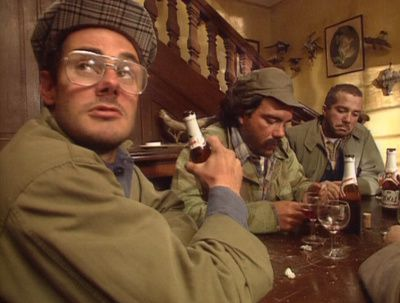

Il est 1h du matin, et je me réveille dans 5 heures par la demande de biberon de mon fils d'un an.

Je n'arrive pas à dormir, hanté par mes réflexions sur quelques éditos qui m'ont irrité, venant par exemple de Patrick Cohen (l'un sur le [bon sens](https://www.youtube.com/watch?v=ja4dG0KUuRc) ou un autre sur [l'étude contre la chloroquine](https://twitter.com/cavousf5/status/1264968414658994177?s=20)), ou ceux de Thomas Legrand ([celui de ce matin sur le même sujet](https://www.franceinter.fr/emissions/l-edito-politique/l-edito-politique-25-mai-2020) par exemple).

Pour passer cette irritation, il faut que je la mette sur papier. Même à 1h23 du matin.

Pour poser les bases, sachez que je n'ai pas d'aversion automatique pour ces personnages que sont les journalistes éditocrates. De temps à autre leur analyse me plait bien, ce qui fait que je les écoute encore. Mais parfois, je ne sais pas ce qui me retient de les bannir à tout jamais.

Parce que parfois, et de plus en plus souvent malheureusement, leurs façons de faire m'exaspère. Et lorsque ces moments arrivent, je trouve qu'ils ne remplissent pas leur mission de journaliste comme ils devraient le faire.

Être éditorialiste, c'est donner son opinion, certes, mais cela ne dispense pas d'être journaliste.

Or, qu'est-ce qu'un journaliste à mes yeux ? Si le lecteur en est un, peut-être me trouvera-t-il un peu présomptueux de vouloir proposer ma vision d'un métier que je ne pratique pas, mais après tout, c'est un métier dont je suis le réceptacle de la production, donc je peux bien donner mon avis, en tant que client. C'est la procédure d'amélioration continue qu'on m'a apprise en école d'ingénieur : on produit, on évalue, puis on corrige. Voici donc venu le temps de mon évaluation !

Être journaliste donc, c'est être un acteur des médias, un médiateur, quelqu'un dont la mission est d'informer le grand public des choses qui se passent hors de son domaine. C'est une sorte d'éducateur continuel, puisque par son information il va remettre des évènements dans leur contexte, les étoffer pour permettre à son public d'avoir une vision globale des sujets abordés, afin que chacun puisse se faire sa propre opinion pour agir en citoyen responsable. L'instituteur nous donne des bases pour comprendre le monde lorsqu'on sera adulte, le journaliste poursuit son travail en formation continue tout au long de la vie.

Un journaliste ne pourra pas être objectif, certes, c'est impossible, mais il tâchera au moins de rester honnête, envers lui-même et envers son public. Lorsqu'il biaise une information, il le dira, s'il en est conscient. Ne pas désinformer, continuer à former.

Alors, au regard de cette brève et grossière description de ce que je pense du jounalisme, qu'est-ce qui ne va pas dans les derniers éditos des comparses que j'ai cités ? Eh bien, je trouve qu'il y a chez eux une mauvaise exécution de leur tâche.

En effet, trop souvent on a à faire à une généralisation, une catégorisation systématique des gens et de ce qu'ils pensent. Contre la spéculation financière ? D'extrême gauche. Contre l'islam radical ? D'extrême droite. Critique envers l'Union Européenne ? Populiste, c'est certain, mais de gauche ou de droite, ça dépend ce qu'on critique. Contre le libre-échange ? Gauchiste, et populiste, ça dépend des sauces.

L'analyse sur le fond y perd beaucoup, et l'explication des enjeux disparait dans la catégorisation systématique et a priori des idées. Avant de savoir les tenants et aboutissants d'un sujet, on dit que ceux qui le pensent sont d'extrême-quelque-chose ou, encore plus efficace, populistes. De droite ou de gauche, peu importe : populistes. La méthode est souvent la même d'ailleurs : on énonce l'idée, on dit qu'elle est énoncée par des populistes, on paraphrase un peu, en expliquant la forme, et souvent on s'arrête là, pensant que cette analyse se suffit à elle-même pour expliquer le bien fondé de l'idée. Le job est fait. Pas de développement en long en large et en travers du fond de l'idée : lorsqu'on associe une idée à du populisme, il va de soi qu'elle est idiote.

De temps en temps, ça en devient débile. Exemple l'édito de Cohen sur le bon sens. Soit, Donald Trump est un clown, et il utilise c'est vrai cette expression pour expliquer nombre de ses pitreries. Soit, les politiques divers et variés ont chacun leur notion de bon sens. Mais enfin, sous-entendre que le bon sens ne vaut rien parce qu'il est utilisé par des gens qu'on qualifie pour certains de populistes, c'est idiot et futile. C'est de la forme, pas du fond. Donc placer le populisme, mot dégradant dans la bouche des journalistes qui l'utlisent, à côté du bon sens, c'est discréditer toute idée qui serait énoncée entourée de bon sens. Pourquoi ne pas plutôt expliquer l'idée en elle-même, plutôt que de la jeter comme une malpropre d'une manière ou d'une autre ? Justement, à toi journaliste de m'expliquer clairement les choses, à moi qui t'écoute de lui accorder le crédit que je veux lui donner, bon sens ou pas !
Et Roselyne Bachelot, invitée toute les semaines dans l'émission, ancienne politicienne professionnelle, donc biaisée dans son raisonnement, rangée du côté des non populistes, donc des gentils et intelligents - Roselyne Bachelot donc d'enchainer sur le sujet, en disant que les gilets jaunes, populistes donc idiots et dangereux, ne se sont jamais plaint du manque de masques, alors même qu'ils manifestaient entre autre pour la défense des moyens de l'hôpital public ; ou en disant que personne n'avait parlé pandémie lors de la campagne de 2017, alors même que Mélenchon en avait parlé lors de meetings. Qui est l'idiot dans l'histoire ?

Cette manie, de la part de journalistes professionnels, de vouloir généraliser, catégoriser toute pensée, toute personne, et de chercher à discréditer ou accréditer toute chose, c'est, comme le dit bien Cohen toujours à propos du bon sens par ailleurs, omettre la dimension complexe des sujets abordés. C'est donc une faillite grossière du journalisme que de traiter l'information de cette manière, puisque son rôle est justement de nous rendre compréhensibles les choses complexes de notre monde. Dire qu'un sujet est complexe, ça ne suffit pas pour le décomplexifier. Le traiter sur la forme qu'utilisent les divers acteurs, souvent politiques, ce n'est pas nous en expliquer honnêtement, à défaut d'objectivement, le fond. Discréditer toute idée issue d'une personnalité qu'on a catégorisée en populiste, mot à vomir à souhait, c'est aller à l'encontre de la mission du journaliste.

Pour aller encore plus loin, je dirais même que, le rôle du journaliste est tellement important dans l'animation sereine de notre démocratie, sa responsabilité est telle dans la bonne conduite de notre information et de notre action citoyenne qui se traduit à travers le vote - le rôle du journaliste est tel que faillir dans sa mission, c'est être responsable en partie du mal-être de notre société. Si l'ambiance est si tendue, si les gens ont tant de rancoeur vis-à-vis de ceux qui ne pensent pas comme eux, c'est parce que les journalistes ne mettent pas assez d'effort et de rigueur pour remplir leur mission d'information.

Toujours sur cette expression de populiste : les acteurs politiques ont le droit de s'en servir, pas de problème avec ça. La politique est une bataille, idéologique, réthorique, stratégique, pour gagner des élections, donc toutes les armes sont permises, y compris discréditer son adversaire, naturellement. Fasciste, néo-libéral, communiste, socialiste, populiste et j'en passe : j'homologue tous ces adjectifs, s'ils sont tenus par des politiciens. Le néo-libéral traitera ses adversaires de populistes et réciproquement : c'est de bonne guerre. S'agissant des journalistes, je ne les homologues pas tous, et surtout pas populiste. Car en plus de catégoriser, ce mot vient y ajouter un sentiment de dégout, de bêtise, de "surtout pas ça", voire de "c'est du bon sens que de ne pas penser ça", pour titiller un peu notre Cohen national.
Or, d'une part tout n'est pas à jeter dans ce que pensent ceux qu'on appelle populistes - exemple avec ce risque pandémique dont parlait Mélenchon en 2017, mais je vais m'arrêter là avec la France Insoumise parce qu'on irait croire que j'ai un intérêt chez eux : non, car j'ai voté Sarko dans le passé, et en ce moment, je vote blanc.
D'autre part, ces populistes, pour peu qu'on y intègre en France la France Insoumise et le Rassemblement National (voyez la cohérence du raisonnement), en Grande-Bretagne les partisans du Brexit et de Boris Johnson, ou encore et Italie ceux du mouvement 5 étoiles et de Matteo Salvini : ces populistes représentent à peu près partout plus ou moins la moitié des électeurs. J'écarte Trump du raisonnement, parce que les États-Unis sont bien trop déconnectés de nous culturellement pour avoir leur place dans ma démonstration, d'autant que là-bas seulement la moitié des électeurs vont voter là où au moins trois quarts chez nous se rendent aux urnes.

Donc cette expression "populisme", employée à tout va par les journalistes des grands médias nationaux lorsqu'il s'agit de ridiculiser une idée ou un personnage, va droit au coeur d'une moitié de citoyens. Ridiculiser, c'est d'ailleurs probablement le mot précis que je cherche depuis le début de cet article, qui illustre parfaitement le ressenti que j'ai lorsque j'entends certains parler de populisme. De sorte que les journalistes censés nous expliquer la complexité du monde, décident plutôt de catégoriser personnes et idées sans en essayer de comprendre puis d'expliquer le fond et, en conséquence, choisissent de ridiculiser près de la moitié des citoyens. Je ne pense pas que la tactique soit payante pour amener de la sérénité dans le débat public. C'est pourtant la sérénité qui fait avancer le schmilblick, alors que l'électricité dans l'air est plutôt source de dangers à venir...

Je pourrais m'arrêter là, mais il est 2h37 maintenant, et écrire cet article ne m'a pas du tout aider à m'endormir... donc j'extrapole un tout petit peu.

On s'étonne ensuite que certaines personnes se détournent des médias qu'ils appellent désormais "mainstream". Personnellement, je ne m'en détourne pas parce qu'il est important d'avoir de tout comme information - je suis abonné à vie à Libération par exemple, et j'écoute France Inter tous les matins - mais je m'informe aussi différemment, via des sources qui ne cherchent pas à me catégoriser comme populiste.

Car oui, je me sens visé lorsqu'on parle de populisme, voyez plutôt : je pense que la finance spéculative, celle des produits dérivés et des paris, est néfaste ; je pense que la corruption de manière générale est beaucoup plus importante que la place qui lui est accordée dans nos médias, et qu'elle est la source de nombreux dysfonctionnements et injustices ; je pense que l'emprise des entreprises mondiales sur l'agencement de nos sociétés, de nos lois et de nos États, est bien trop importante et néfaste ; lorsque je lie cette emprise avec la corruption, le mot d'oligarchie me vient à la bouche ; je pense qu'il y a parfois des complots dans la vie, je suis donc complotiste en plus d'être populiste, le comble ; j'ai fait campagne législative en 2017 avec l'idée d'harmonisatino fiscale et sociale de l'Union Européenne en pensant que j'étais un génie, jusqu'à ce que mon oncle de 60 ans, macroniste pourtant, me calme en me disant que ça fait 30 ans (mon âge en 2017) que c'est une promesse non tenue, que donc je peux toujours me brosser, j'ai donc aussi un certain rejet de l'Union Européenne.

Peut-être prendrai-je le temps d'expliquer plus en longueur pourquoi je pense tout ça, mais là n'est pas le sujet de cette nuit.

Le sujet est que ça me fait plaisir de temps en temps d'écouter ou de lire des choses qui ne ridiculisent pas ce que je pense. Alors je me suis abonné à [Fakir](https://www.fakirpresse.info), journal du gauchiste Ruffin, et je regarde assidûment chaque épisode de [Thinkerview](https://www.youtube.com/channel/UCQgWpmt02UtJkyO32HGUASQ). Je suis de près [Gaël Giraud, qui a fait ma formation économique](https://editions.flammarion.com/Catalogue/champs-essais/philosophie/20-propositions-pour-reformer-le-capitalisme), Je débat aussi avec mes proches, plutôt de droite voire d'extrême droite pour certains (spéciale dédicace à ceux qui se reconnaissent), et ça fait du bien de se cracher dessus sans pour autant qu'on se traite de populistes à tout va, ou alors sur le ton de la blague. On est pas d'accord sur tout, on l'est sur d'autres choses, mais le débat est toujours vif, animé, et fait avancer des schmilblicks dans nos têtes respectives.

Ridiculiser, c'est interdire de penser, et ça ne peut être que néfaste. Alors s'il-vous-plait, journalistes qui passez par ici et qui vous sentez visés : reprenez-vous, et faites-nous plaisir.

Il est 3h26, temps d'aller essayer de me coucher.

Ah ça fait du bien d'écrire, je vous le recommande !

