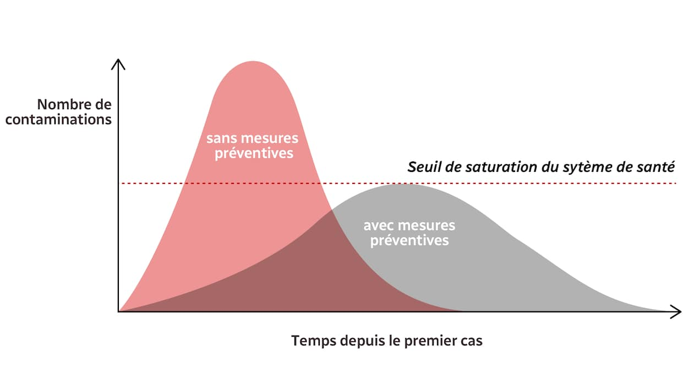

Ça y est, on reconfine. Le virus contamine trop de gens. Il y a trop de venues en services de réanimation, qui sont incapables de prendre tout le monde en charge. Et donc on se confine, pour ralentir au maximum la propagation du virus, éviter d'avoir trop de contaminés à l'hôpital, et éviter ainsi au médecin de trop devoir choisir qui doit vivre, et qui doit mourir. Mais est-ce que ce second confinement est une bonne chose, au fond ?

## Le médecin n'a pas droit de vie ou de mort, mais pouvoir de sauver

Commençons par rectifier notre introduction : le choix du médecin n'est pas qui *doit vivre* contre qui *doit mourir*, mais qui va-t-il *pouvoir sauver* entre tous ceux qui arrivent dans son hôpital. En comparaison, le maître nageur, seul sur sa plage devant deux ou trois personnes qui se noient en même temps, est confronté au même choix. Il pourra toujours se reprocher de ne pas avoir été avec un collègue pour l'aider, mais il pourra surtout se féliciter d'avoir sauvé quelqu'un.

On se confine, tous, pour ne pas nous dit-on submerger les services de réanimation. Or, j'ai comme l'impression que les hospitalisations et les services de réanimation sont submergés, certes, mais par peu de monde comparé à la population entière, et ce peu de monde est constitué en majorité par des personnes âgées de plus de soixante ans ([voir les chiffres](https://www.francetvinfo.fr/sante/maladie/coronavirus/infographies-covid-19-morts-hospitalisations-age-malades-l-evolution-de-l-epidemie-en-france-et-dans-le-monde-en-cartes-et-graphiques.html)), parmi lesquels le personnel médical doit décider qui sauver. Est-ce sain de confiner une population entière pour éviter au médecin d'avoir ce (certes difficile) choix à faire ? Est-ce un devoir de la société *entière* que de s'interdire de vivre en liberté pour sauver une (grosse) poignée d'entre nous qui n'auraient pas eu la possiblité d'être réanimés, dont par ailleurs beaucoup on vécu déjà plus de 60 ans ? Les chiffres varient, mais le premier confinement aurait [sauvé 60 000 personnes](https://www.lesechos.fr/economie-france/social/coronavirus-plus-de-60000-vies-sauvees-par-le-confinement-en-france-1197551), parait-il...

## Mourir, c'est la vie !

Il y a cinq ans, je suis allé présenter ma fiancée à ma grand-mère chérie, 87 ans. Ce qui aurait dû être un moment de joie tourna en drame, puisque après un bon porto et une demi-heure de discussion, elle subit une attaque - infarctus, AVC, que sais-je, je suis développeur ! - toujours est-il qu'elle perd conscience. On appelle donc SAMU et pompiers, on fait ce qu'on peut puisqu'elle respire encore dans son inconscience, et on essaye de paniquer le moins possible. Les soins arrivent après une demi-heure, ma grand-mère ne parle plus et n'a pas retrouvé ses esprits, mais au moins son calme, plus de convulsion. Puis une demi-heure plus tard, ça reprend, fatalement : ma grand-mère est morte sous mes yeux. En très bonne santé à midi, la voilà partie deux heures plus tard.

Imaginons que les soins soient arrivés 5 minutes après le drame et non 30 minutes, et qu'elle ait été à l'hôpital 10 minutes plus tard : on m'a dit qu'alors elle aurait été prise en charge dans service de réanimation sur le champ, et qu'elle aurait donc pu survivre à cette attaque, inch'allah. Au moins, on aurait essayé. Eh bien, peut-être que ça vous étonnera, mais je ne suis pas sûr que j'aurais voulu qu'on la réanime. Elle serait peut-être partie une semaine plus tard, elle serait peut-être encore là à envoyer paître ce coronavirus, ou à retourner en réanimation contaminée, que sais-je. Mais je me dis qu'au fond, c'est la vie : ce n'est pas dramatique de ne pas avoir eu le SAMU pendant un quart d'heure, ce n'est pas grave qu'elle n'ait pas reçu tout ce que la médecine est capable de faire comme soin, c'est la vie. Ma grand-mère est partie, entourée, à un bel âge, c'est la vie ! Cinq ans de plus, dix ans de moins, ça aurait été la vie !

Mourir, c'est la vie. Le mieux, c'est de ne pas souffrir de la mort qui vient. Et que ça n'arrive pas trop tôt, c'est certain. Par exemple, ma grand-mère, ça aurait pu être plus tard, mais ça n'était pas trop tôt. Moi à mon âge, certains trouveront que c'est un peu tôt encore, mais mon insouciance me dit que si je devais mourir demain, c'est la vie aussi !

## Se protéger : oui !

Retournons à notre cher et foutu corano : on sait qu'il attaque surtout les plus fragiles d'entre nous, ceux dont la condition physique a des failles, donc en majorité la population la plus âgée. On sait aussi que tout le monde peut être porteur du virus et le transmettre à n'importe qui. Que ce virus est quand même plus robuste que la grippe, et qu'on a pas de vaccin. Sachant tout cela, il nous faut protéger les plus faibles, qui risquent de ne pas survivre à une contamination : soit. Donc on met des masques, on ne s'embrasse plus, on lave nos mains et on garde nos distances : ces mesures, quoique contraignantes, ne sont pas inhumaines - on s'y fait même bien - et semblent tomber sous le sens. C'est certain que ça aide à ne pas contaminer ceux qui ne s'en remettraient pas. Malheureusement, ce ne sont que des obstacles, pas des barrières, donc le virus continue son chemin cahin-caha, contamine, et exécute sa mission mortifère. L'hôpital vient à la rescousse quand il peut. Il y a cent ans, il n'aurait probablement que constaté les dégâts, aujourd'hui il peut sauver des malades, dieu merci ! Il y a cinquante ans, il aurait pu accueillir deux fois plus de monde qu'aujourd'hui, dommage...

Tout le monde connait cette courbe désormais : un système de santé est capable de prendre en charge X patients, l'objectif lors d'une pandémie c'est de faire son possible pour maintenir le nombre de patients en dessous de ce que peut prendre le système de santé. La vraie question est : quelles mesures préventives peut-on ou ne peut-on pas imposer ? Masques, gestes barrières, oui. Mais confinement ? 

## Se confiner : z-êtes pas fous ?

Le confinement, juste après le couvre-feu, n'est qu'une mesure parmi d'autres sur l'échelle des contraintes à s'imposer pour passer l'épidémie. Et que faire si malgré cela, les 30 000 morts passent à 200 000 et si les médecins ne peuvent sauver qu'une proportion encore moindre de patients qui viennent à eux ? Que faire si le confinement ne suffirait pas, qu'elle est la mesure suivante encore plus contraignante ? Réquisitionner des drônes pour nous livrer nos rations de nourriture afin d'éviter de faire nos courses nous-mêmes ? Et dans les familles, chacun dans sa chambre d'ailleurs, pour limiter les contacts ? Ça serait absurde. 

Il faut donc qu'il existe une limite dans les contraintes qu'on s'impose, qu'elles soient suffisantes ou pas, à mettre en balance avec les bénéfices qu'elle apporte. Un risque de décimer 30% de la population justifie peut-être un confinement, mais 0,05% ? 0,1% ?

Parce que désormais on connait tous les conséquences d'un confinement ou d'un couvre-feu : ce sont des vies ruinées, par millions, des personnes atteintes psychologiquement et psychiatriquement, dangereuses pour leurs proches, des enfants battus, des femmes et des maris aussi, sûrement par centaines, voire par milliers. Un couvre-feu ou un confinement, ce n'est pas anodin.

Donc on a dans la balance, d'un côté les sacrifiés du confinement, de l'autre les sacrifiés du virus. Qui a plus de poids que l'autre ? les dizaines de milliers de morts ou les centaines de milliers de vies endommagées ? Les milliers de gens sauvés par les cinq ou dix mille lits d'hôpitaux libérés grâce au confinement, ou les autres qui ne sont plus traités ?

Faut-il à tout prix, même au prix d'un confinement, faire tout pour épargner aux médecins de choisir qui sauver ou qui ne pas sauver ? Vous l'avez compris, je m'y oppose, je mets la tolérance des mesures préventives plus bas que ça. 

Alors soit, donnons cette épreuve au médecin. Mais alors, comment décider de qui sauver ou pas ?

## Soyons tous responsables !

Je ne demande pas au législateur de mettre une règle en place qui déciderait de ce choix. Ce genre de règle, ou de norme si vous voulez, serait directement à ranger dans les superflues. 

Oui, il faut savoir aussi laisser les gens décider par eux-mêmes, parce que c'est la vie ! La vie, ce n'est certainement pas se protéger éternellement jusqu'à la mort, grâce à des règles pseudo-protectrices qu'on nous impose. Non, vivre, c'est aussi prendre des risques, minuscules pour certains, gigantesques pour d'autres, c'est décider soi-même de certaines choses, sans être toujours pris par la main. La vie c'est choisir, bien sûr, qui on veut voir, ce qu'on veut faire, c'est savoir être libre de faire sa vie en société comme on l'entend ! 

Être responsable, c'est justement tout ça en même temps. Et c'est dans un cas d'urgence comme cette pandémie que le sens de la responsabilité de chacun est à réquisitionner. C'est au citoyen de se protéger et de protéger les autres. C'est au médecin de choisir qui sauver, en suivant ses principes, son instinct, ses leçons reçues, son expérience. Chacun dans sa responsabilité.

## La responsabilité de l'État

Celle de l'État est importante. Outre la coordination de tout ça, en mettant à disposition suffisamment de matériel et de personnel médical et en donnant des consignes de mesures préventives à nous citoyens, il faut mettre en oeuvre les conditions nécessaires pour poursuivre la vie en société.

Choisir le confinement, c'est justement choisir de mettre entre parenthèse cette vie en société, et de la mettre sous perfusion en distribuant, à la place des entreprises, des dizaines de milliards d'euros de salaires. Ce qui n'empêchera pas une fermeture d'entreprises d'une manière ou d'une autre, dans une moindre mesure certes. Et donc une remontée du chômage, de la pauvreté, de la précarité, qui sont déjà à des seuils relativement importants, non satisfaisants.

À l'inverse, choisir de ne pas se confiner, c'est effectivement subir des pertes plus lourdes parmi nos concitoyens, peut-être le double ou le quadruple du chiffre actuel. Au lieu de 5 morts pour dix milles personnes actuellement, on serait donc à 10, 15, 20 ou 50 pour dix mille. Est-ce une épreuve ? Oui, encore plus pour le personnel médical. Est-ce dramatique ? Je ne pense pas.

Mais surtout, choisir de ne pas se confiner, c'est avoir à disposition ces dizaines de milliards d'euros pour faire autre chose que perfuser ! Imaginons que l'activité ne se soit pas arrêtée, mais que la même baguette magique de l'État ait dit : « Nous voici en possession de cent milliards ! Nous allons donc réaliser ce que les entrepries privées ne veulent ou ne peuvent pas faire : soulager le personnel médical en augmentant les capacités d'accueil et en payant au juste prix tout ce beau monde, augmenter la paie des professeurs pour donner plus envie de choisir ce métier, rétablir du train partout pour tout, redonner de la vie à notre agriculture en embauchant des gens pour un métier humain, bref, donner une impulsion gigantesque et créative pour redonner du boulot intéressant à tout le monde ! » On aurait peut-être eu, laissez-moi et laissez-vous rêver, des créations d'emplois par millions, une joie de vivre qui revient au quotidien, dans des métiers qui rendent heureux, des campagnes qui se repeuplent, des banlieues qui se désengorgent et se recontruisent plus joliment, des villes qui calment leur frénésie immobilières, des loyers abordables pour tout le monde... et peut-être, à long terme, qui sait, moins de jeunes proies françaises laissées au bord de la société, sujettes à être facilement transformés en terroristes par des sectes, pour faire des carnages sur leur propre territoire ! Mais je m'égare...

En tout cas, c'est cet État là que j'aurais préféré. Un État qui nous fait tous avancer, pas un État qui détruit en voulant protéger. Un État faisant confiance à ses citoyens et à leurs responsabilités.

Mais peut-être me trompe-je ? Dites-moi !

En attendant, à Amsterdam, on est toujours pas confiné, que ça continue !
